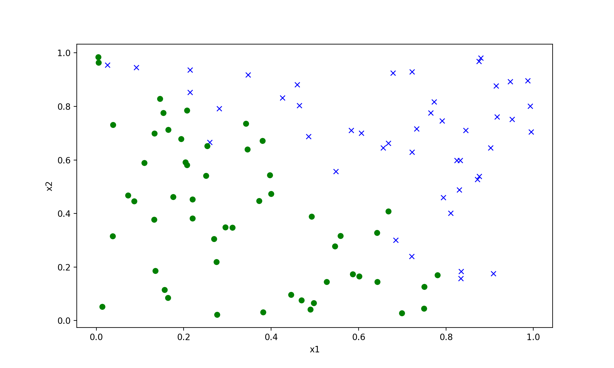
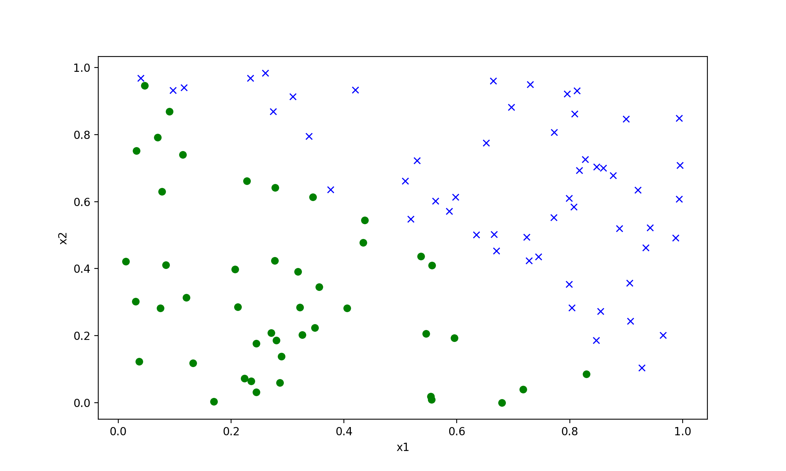

## Data set
```csv
y,x0,x1
-1.000000000000000000e+00,5.956630502064887978e-01,1.930721369700331147e-01
1.000000000000000000e+00,8.999454640117418025e-01,8.459224350533809389e-01
```
note that this is classification with +/- 1 labels.  
Refer to corresponding supplementary-notes.

## Code analysis
It's a typical BGD implementation with vectorization.
### calc_grad
This part computes the gradient of the loss with respect to theta.  
It's slightly different from the previous loss function that we used when y label is among {0,1}.  
Refer to "Binary classification with +:-1 labels" for this.  

## (a)

### Command : python3 p01.py a
Once run the code, it only went through 30368 iterations and converged with data set A, but data set B couldn't finish iteration before interruption.(couldn't converge)  
```bash
==== Training model on data set A ====
Finished 10000 iterations
Finished 20000 iterations
Finished 30000 iterations
Converged in 30368 iterations

==== Training model on data set B ====
Finished 10000 iterations
Finished 20000 iterations
Finished 30000 iterations
Finished 40000 iterations
Finished 50000 iterations
Finished 60000 iterations
Finished 70000 iterations
Finished 80000 iterations
Finished 90000 iterations
Finished 100000 iterations
Finished 110000 iterations
Finished 120000 iterations
Finished 130000 iterations
Finished 140000 iterations
Finished 150000 iterations
....

```

## (b)
As problem indicates that the issue is not becuase of numerical rounding or over/underflow error, it is highly reasonable to deduce that the issue is due to the inappropriate choice of learning rate specific to data set B.  
If the assumption is correct, theta will oscillate between two values when training with data set B.  
As theta is 3-dimenionsal vector, we can easily trace the change of theta visualy by plotting it.  
But before that, we can verify our hypothesis by printing out theta.  
### Command : python3 p01.py b theta
Out of my expectation, however, the values of element in theta kept increasing/decreasing on like follows.
```bash
Finished 10000 iterations
Theta ended with : [-52.74109217  52.92982273  52.69691453]
Finished 20000 iterations
Theta ended with : [-68.10040977  68.26496086  68.09888223]
Finished 30000 iterations
Theta ended with : [-79.01759142  79.17745526  79.03755803]
Finished 40000 iterations
Theta ended with : [-87.70771189  87.87276307  87.73897393]
Finished 50000 iterations
Theta ended with : [-95.01838735  95.1948202   95.0551918 ]
...
Theta ended with : [-346.12483815  348.39301114  345.83900574]
Finished 2400000 iterations
Theta ended with : [-346.56054054  348.83131506  346.27427052]
Finished 2410000 iterations
Theta ended with : [-346.99477753  349.26813649  346.70807198]
Finished 2420000 iterations
Theta ended with : [-347.42755947  349.70348591  347.14042047]
```

Now that learning rate is not a problem, I plot the data set A and B.  
### Command : python3 p01.py b plot
  
  
From the pic, decision boundary is obvious. 

