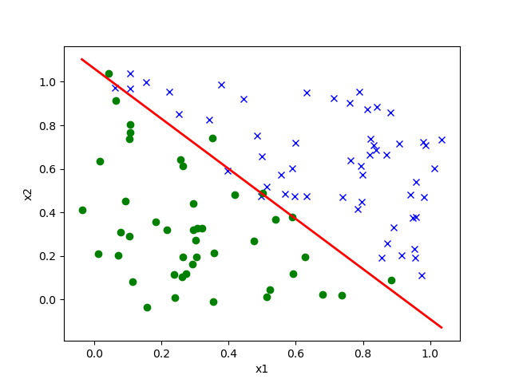

# (i)

## Added Code
For convenience, I slightly modified code

```python
def logistic_regression(X, Y, learning_rate = 10):

def main(learning_rate = 10):
    print('==== Training model on data set A ====')
    Xa, Ya = util.load_csv('../data/ds1_a.csv', add_intercept=True)
    logistic_regression(Xa, Ya,learning_rate)

    print('\n==== Training model on data set B ====')
    Xb, Yb = util.load_csv('../data/ds1_b.csv', add_intercept=True)
    logistic_regression(Xb, Yb, learning_rate)


if __name__ == '__main__':
    main()

```
## Command : python p01.py c 1 {desired learning rate}
Tried 10 different learning rates
{1,2,3,4,5,7,8,12,15,20,50}
## Results
All of them converged with same number of iterations with Dataset A, but none of them converged at least in 300000 iterations with Datset B.  

# (ii) Decreasing the learning rate over time 

## Command : python3  p01.py c 2

## Added code
```python
# parameters of logistic_regression()
def logistic_regression(X, Y, learning_rate = 10,decrase_lr = False, savepath = 'output/?.png'):

# logistic_regression()
        learning_rate = learning_rate * 1/(i**2) if decrase_lr  else learning_rate
# p02c()
    logistic_regression(Xa, Ya, decrase_lr = True, savepath = '../p01/output/p01c_iiA.png')
    logistic_regression(Xb, Yb, decrase_lr = True, savepath ='../p01/output/p01c_iiB.png')
```
## Result
```bash
==== Training model on data set A ====
Converged in 12 iterations

==== Training model on data set B ====
Converged in 12 iterations
```
From the plot, it seems not bad.  
  
  

# (iii) Linear scaling of the input features.
## Command : python3  p01.py c 3


# (iv) Adding a regularization term to the loss function.
It requires L2 regularization.  
## Command : python3 p01.py c 4
## Code added
```python
    theta = ( (1-2*learning_rate/m)*theta - learning_rate * grad ) if regularizer else (theta - learning_rate * grad)

```
## Result
It even couldn't converge with dataset A.
```bash
==== Training model on data set A ====
Finished 10000 iterations
Finished 20000 iterations
Finished 30000 iterations
Finished 40000 iterations
Finished 50000 iterations
Finished 60000 iterations
Finished 70000 iterations
Finished 80000 iterations
Finished 90000 iterations
...

==== Training model on data set B ====
Finished 10000 iterations
Finished 20000 iterations
Finished 30000 iterations
Finished 40000 iterations
Finished 50000 iterations
Finished 60000 iterations
Finished 70000 iterations
Finished 80000 iterations
...
```


# (v) Adding zero-mean Gaussian noise to the training data or labels.

## Code added
* add Gaussian function
  ```python
    def add_gaussian_noise(data, std_dev):
        """
        Adds Gaussian noise to the data.

        Args:
            data : Original data (can be training data or labels)
            std_dev : Standard deviation of the Gaussian noise.
            return : Data with added Guassian noise.
        """
        noise = np.random.normal(0, std_dev, data.shape)
        return data + noise
    ```

## Results
I tried with 10 different std_deviations, but for the clearance, only introduce specific results for std deviation 0.1  
The whole result is in appendix A.  

### Only to the training data
```bash
==== Training model on data set A ====
Converged in 2927 iterations

==== Training model on data set B ====

Converged in 2489 iterations
```




### Only to the label
```bash
==== Training model on data set A ====
Finished 10000 iterations
Finished 20000 iterations
Finished 30000 iterations
Converged in 30039 iterations

==== Training model on data set B ====

Finished 10000 iterations
Finished 20000 iterations
Finished 30000 iterations
Finished 40000 iterations
Finished 50000 iterations
Finished 60000 iterations
Finished 70000 iterations
Finished 80000 iterations
Finished 90000 iterations
...
```

### Both
```bash
==== Training model on data set A ====
Converged in 2677 iterations

==== Training model on data set B ====

Converged in 4417 iterations
```

## Appendix A