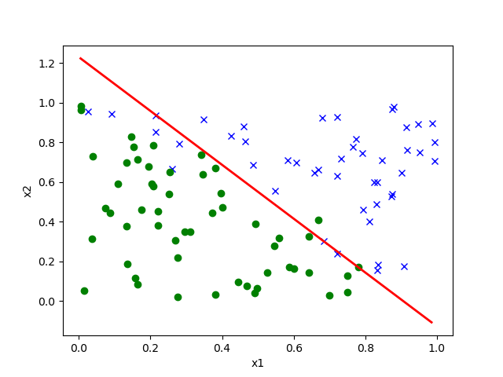
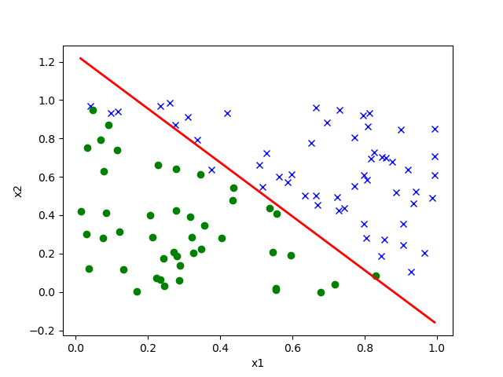

# (i)

## Added Code
For convenience, I slightly modified code

```python
def logistic_regression(X, Y, learning_rate = 10):

def main(learning_rate = 10):
    print('==== Training model on data set A ====')
    Xa, Ya = util.load_csv('../data/ds1_a.csv', add_intercept=True)
    logistic_regression(Xa, Ya,learning_rate)

    print('\n==== Training model on data set B ====')
    Xb, Yb = util.load_csv('../data/ds1_b.csv', add_intercept=True)
    logistic_regression(Xb, Yb, learning_rate)


if __name__ == '__main__':
    main()

```
## Command : python p01.py c 1 {desired learning rate}
Tried 10 different learning rates
{1,2,3,4,5,7,8,12,15,20,50}
## Results
All of them converged with same number of iterations with Dataset A, but none of them converged at least in 300000 iterations with Datset B.  

# (ii) Decreasing the learning rate over time 

## Command : python3  p01.py c 2
## Added code
```python
# logistic_regression
    learning_rate *= 1/(i**2)
```
## Result
```bash
==== Training model on data set A ====
Converged in 12 iterations

==== Training model on data set B ====
Converged in 12 iterations
```
From the plot, it seems not bad.  
  
  

# (iii) Linear scaling of the input features.

# (iv) Adding a regularization term to the loss function.
It requires L2 regularization.

# (v) Adding zero-mean Gaussian noise to the training data or labels.

## To the training data