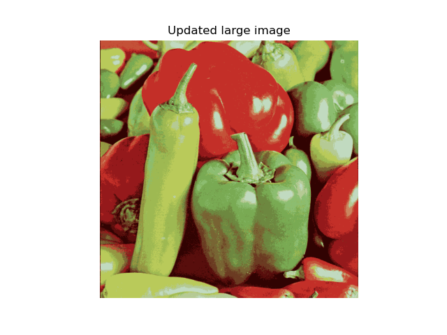
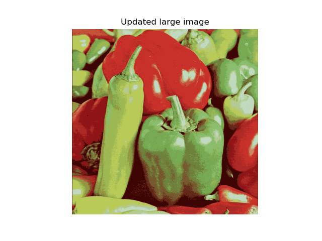
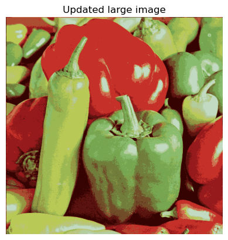
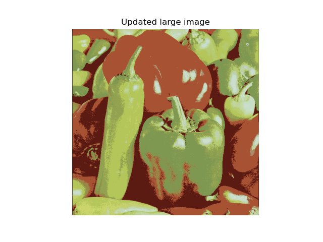
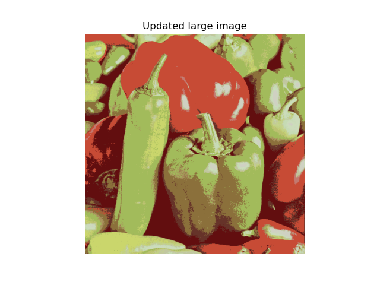
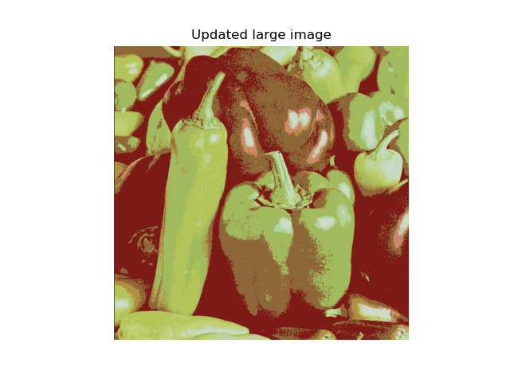
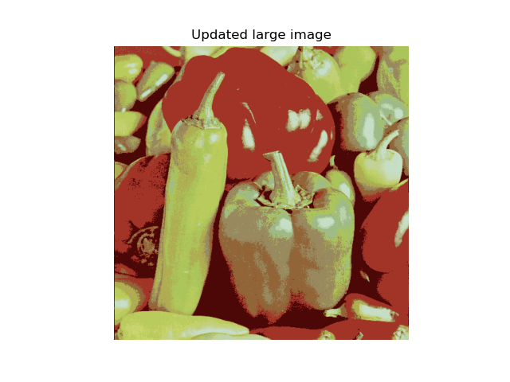
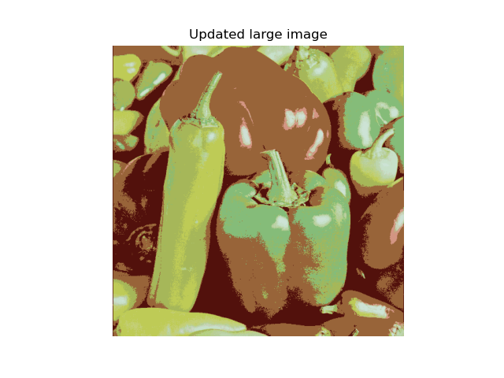

# hyperparameters
`max_iter` : total number of iterations to run through
`num_clusters` : number of centroids

# `main(args)`

## Load small image and visualize
```python
plt.axis('off')
```
hides both x and y axis labels and ticks

```python
savepath = os.path.join('.', 'orig_small.png')
```
combines the current directory (`','`) with the file name(`'orig_small.png'`) using the `os.path.join` function.  


# brute force mode (3 loops)

```python
def update_centroids(centroids, image, max_iter=30, print_every=10):
    """
    Carry out k-means centroid update step `max_iter` times

    Parameters
    ----------
    centroids : nparray
        The centroids stored as an nparray
    image : nparray
        (H, W, C) image represented as an nparray
    max_iter : int
        Number of iterations to run
    print_every : int
        Frequency of status update

    Returns
    -------
    new_centroids : nparray
        Updated centroids
    """

    # *** START YOUR CODE ***
    # raise NotImplementedError('update_centroids function not implemented')
        # Usually expected to converge long before `max_iter` iterations
                # Initialize `dist` vector to keep track of distance to every centroid
                # Loop over all centroids and store distances in `dist`
                # Find closest centroid and update `new_centroids`
        # Update `new_centroids`
    num_clusters = centroids.shape[0]
    H, W, C = image.shape
    iter = 0
    while True:
        iter+=1
        dists = np.zeros((H,W,num_clusters),dtype = np.float64)
        numerators = np.zeros((num_clusters,3),dtype=np.float64)
        denominators = np.zeros((num_clusters,1),dtype = np.float64)
        for i in range(H):
            for j in range(W):
                for k in range(num_clusters) : 
                    dists[i,j,k] = np.linalg.norm(image[i,j] - centroids[k])
                idx = np.argmin(dists[i,j])
                numerators[idx] += image[i,j]
                denominators[idx] +=1
        centroids = numerators / denominators
        if iter % print_every == 0 :
            print('Finished %d iterations' % iter)
        if iter > max_iter :
            break
    # *** END YOUR CODE ***
    new_centroids = centroids.astype(int)

    return new_centroids
```


```python
def update_image(image, centroids):
    """
    Update RGB values of pixels in `image` by finding
    the closest among the `centroids`

    Parameters
    ----------
    image : nparray
        (H, W, C) image represented as an nparray
    centroids : int
        The centroids stored as an nparray

    Returns
    -------
    image : nparray
        Updated image
    """

    # *** START YOUR CODE ***
    # raise NotImplementedError('update_image function not implemented')
            # Initialize `dist` vector to keep track of distance to every centroid
            # Loop over all centroids and store distances in `dist`
            # Find closest centroid and update pixel value in `image`
    # *** END YOUR CODE ***
    num_clusters = centroids.shape[0]
    H, W, C = image.shape
    dists = np.zeros((H,W,num_clusters), dtype = np.float64)
    for i in range(H):
        for j in range(W):
            for k in range(num_clusters):
                dists[i,j,k] = np.linalg.norm(image[i,j] - centroids[k], axis = 1)
            idx = np.argmin(dists[i,j])
            image[i,j] = centroids[idx]
    return image
```

## vectorization (2 loops)
```python
def update_centroids(centroids, image, max_iter=30, print_every=10):
    """
    Carry out k-means centroid update step `max_iter` times

    Parameters
    ----------
    centroids : nparray
        The centroids stored as an nparray
    image : nparray
        (H, W, C) image represented as an nparray
    max_iter : int
        Number of iterations to run
    print_every : int
        Frequency of status update

    Returns
    -------
    new_centroids : nparray
        Updated centroids
    """

    # *** START YOUR CODE ***
    # raise NotImplementedError('update_centroids function not implemented')
        # Usually expected to converge long before `max_iter` iterations
                # Initialize `dist` vector to keep track of distance to every centroid
                # Loop over all centroids and store distances in `dist`
                # Find closest centroid and update `new_centroids`
        # Update `new_centroids`
    num_clusters = centroids.shape[0]
    H, W, C = image.shape
    iter = 0
    while True:
        iter+=1
        numerators = np.zeros((num_clusters,3),dtype=np.float64)
        denominators = np.zeros((num_clusters,1),dtype = np.float64)
        for i in range(H):
            for j in range(W):
                idx = np.argmin(np.linalg.norm(image[i,j] - centroids,axis=1))
                numerators[idx] += image[i,j]
                denominators[idx] +=1
        centroids = numerators / denominators
        if iter % print_every == 0 :
            print('Finished %d iterations' % iter)
        if iter > max_iter :
            break
    # *** END YOUR CODE ***
    new_centroids = centroids.astype(int)

    return new_centroids

```

### results
  
  
  
  
  

## Other Approach
refer to solutions ('sol' directory)
### results
  
  
  
  
  


# Follow-up

## Follow-up1
If you compare set of pictures from my code and solution, you can find that the previous are generally more 
"multi-colored" than posterior.  
Can you explain why this happens?  

## Follow-up2
when I use dtype `np.uint8` instead of `np.float64` for numerator and denominator, it gives me whole black pic for "most" of the time.  
Can you explain why?  
